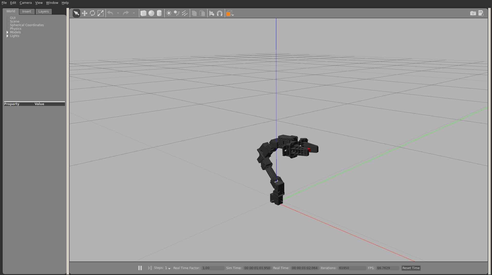

# Openmanipulator Sara Docker Wrapper
This repository provides a Docker-based solution to ensure legacy support for the [openmanipulator sara repo](https://github.com/zang09/open_manipulator_6dof_application).
Openmanipulator Sara extends the low cost arm [Openmanipulator](https://github.com/ROBOTIS-GIT/open_manipulator) to a total of 6 DOF, enhancing the flexibility capabilities of the robot arm. 
The Docker architecture in this repository allows the code originally designed for Ubuntu 16 and ROS1 to run seamlessly on any Ubuntu distribution. 

It has been successfully tested on Ubuntu 22.04.4.


## Prerequisites
Before installing and building the Docker container, ensure the following dependencies are installed:
- [Docker](https://www.docker.com/) Install Docker on your host machine.
- [Post installation steps](https://docs.docker.com/engine/install/linux-postinstall/) Complete these steps to enable non-root Docker usage. 
- [Nvidia toolkit](https://docs.nvidia.com/datacenter/cloud-native/container-toolkit/latest/install-guide.html) Install the toolkit for GPU support.

## Installation on Ubuntu
Follow these steps to clone the repository and build the Docker container:
```
# Clone the repository
git clone https://github.com/DarioRepoRuler/openmanipulator_sara.git
# Allow local root access to the X server
xhost +local:root
# Navigate to the repository
cd openmanipulator_sara
# Build the Docker container
docker build -t openmanipulator_sara .
```
This process clones the repository to your host machine and builds the Docker container.

# Installation on Windows

On Windows the installation process is more complicated. You will need 
- Windows Subsystem for Linux 2 (WSL2)
- [Docker Desktop](https://www.docker.com/products/docker-desktop/)
<!-- - VcXSrv (for x forwading) -->

First make sure you have WSL2 installed and install Ubuntu (it is not importatn which version of Ubuntu, default should be fine)
``` 
wsl -d install Ubuntu
``` 

For simulation purposes please be sure to that X11 applications are running smoothly. You can check this with xeyes in WSL2. Per default it should be X forwarding should be enabled. If not please contact us. 

After this you are ready to install Docker Desktop. Be sure to have two things set in docker desktop:
1. In Docker Desktop -> Generel: check  "Use the WSL 2 based engine"
2. In Docker Desktop -> Ressources: enable the integration with the default WSL distro and enable the Ubuntu version.

Now you are set to build the docker container. 
Depending if your system has GPU or not must build the correspoing 'Dockerfile_cpu' or 'Dockerfile_gpu'(by renaming the corresponding Dockerfile to 'Dockerfile').

Follow the installation instructions and build the docker container as stated in the ubuntu installation instruction, using Ubuntu in WSL2.

## Attach USB ports to WSL and Docker

Under windows the USB access is a more restricted than in Ubuntu. So in order to execute the controllers you must first share the USB port with the WSL system. 
1. Open PowerShell as Administrator and run:
```
winget install --interactive --exact dorssel.usbipd-win
```
This installs `usbipd-win`, which enables USB device sharing with WSL2.

2. After installation, restart your computer to apply changes.

After USBipd is installed `usbipd list` returns you all the USB devices. 

To attach a USB port to WSL and therefore to the docker env, you must
1. Start WSL in a seperate shell
2. Run Powershell as admin.
3. Run `usbipd bind --busid <bus-ids>`. Replace `<bus-ids>` with the corresponding bus-ids from the listing.
3. Run `usbipd attach --wsl --busid <bus-ids>`. Replace `<bus-ids>` with the corresponding bus-ids from the listing.

In WSL now you should be able to list the usb device. Once it is visible in WSL it should be visible in the docker too. 


# Deployment
After building the Docker container, you can run it using the following command:
```
docker run -it \
    --gpus all \
    --env="DISPLAY" \
    --env="QT_X11_NO_MITSHM=1" \
    --env="NVIDIA_VISIBLE_DEVICES=all" \
    --env="NVIDIA_DRIVER_CAPABILITIES=all" \
    --volume="/tmp/.X11-unix:/tmp/.X11-unix:rw"\
    --volume="$HOME/.Xauthority:/root/.Xauthority:rw"\
    --net=host \
    --privileged \
    openmanipulator_sara
```

For non GPU host machines please run the container with:
```
docker run -it \
    --env="DISPLAY" \
    --env="QT_X11_NO_MITSHM=1" \
    --volume="/tmp/.X11-unix:/tmp/.X11-unix:rw" \
    --volume="$HOME/.Xauthority:/root/.Xauthority:rw"\
    --net=host \
    --privileged \
    openmanipulator_sara
```

### ROS Setup
Inside the docker container now ROS is available.
To prepare ROS in the Docker container, source the setup file from the build directory:
```
cd ~/catkin_ws
source devel/setup.bash
```
### Starting ROS Core
Enable ROS communication by running:
```
roscore
```
This must be done within the docker container.

### Controller and Simulation
After starting `roscore`, you can start the controller and the gazebo simulation in seperate terminale.
### Opening additional terminals
To open a new terminal for the same Docker container:
1. List the running docker containers.
    ```
    docker ps
    ```
    This will return the docker **container name** (which is usually not the same as you named the image).
2. Connect to the container:
    ```
    docker exec -it epic_pare bash
    ```
3. Source ROS in new terminal
    Be sure to always source via:
    ```
    cd ~/catkin_ws
    source devel/setup.bash
    ```
### Launch Controller and Simulation
Run the following commands in separate terminals:

```
# Launch the controller
roslaunch open_manipulator_6dof_controller open_manipulator_6dof_controller.launch use_platform:=false
# Launch the Gazebo simulation
roslaunch open_manipulator_6dof_gazebo open_manipulator_6dof_gazebo.launch
```
Once the gazebo simulation pops up, the play button must be pressed.
The gazebo simulation should then look like this.


### GUI 
Once the controller is running, launch GUI program to manipulate OpenManipulator SARA.
```
roslaunch open_manipulator_6dof_control_gui open_manipulator_6dof_control_gui.launch
```
  
### Common issue
A problem which often occurs is:
```
gazeb: cannot connect to X server :0
```
This can be addressed by executing the following command in a terminal in the host machine shell:
```
xhost +local:root
```


# Docker Troubleshooting Guide for Windows 11

## **1. Verify Docker Installation**
Before troubleshooting, ensure that Docker is correctly installed.

- Open **PowerShell** and run:
  ```powershell
  docker version
  ```
  - If Docker is installed and running, you should see both **Client** and **Server** versions.
  - If the server version is missing, Docker Desktop might not be running.

- Run:
  ```powershell
  docker info
  ```
  - This will show detailed information about the Docker daemon.

## **2. Restart Docker and WSL**
If Docker is not behaving correctly, try restarting both WSL and Docker:

- Restart **WSL**:
  ```powershell
  wsl --shutdown
  ```
- Restart **Docker Desktop**:
  1. Close Docker Desktop.
  2. Open **Task Manager** (`Ctrl + Shift + Esc`).
  3. End any Docker-related processes.
  4. Relaunch Docker Desktop.

## **3. Ensure WSL2 is Enabled**
Docker requires WSL2 as the backend on Windows 11.

- Check if WSL2 is installed and running:
  ```powershell
  wsl --list --verbose
  ```
  Expected output:
  ```
  NAME              STATE           VERSION
  * docker-desktop  Running         2
  Ubuntu-22.04      Running         2
  ```
  - If no Linux distributions are listed (except `docker-desktop`), install one from the **Microsoft Store** (e.g., Ubuntu).

- Set WSL2 as the default version:
  ```powershell
  wsl --set-default-version 2
  ```

## **4. Enable WSL2 Backend in Docker**
- Open **Docker Desktop → Settings → General**
- Enable **"Use the WSL 2 based engine"**
- Apply changes and restart Docker.

## **5. Check and Build Docker Image**
Once everything is configured correctly, navigate to your project directory and build your Docker image:

```powershell
cd C:\Users\dario\Desktop\openmanipulator_sara
docker build -t openmanipulator_sara .
```


### Further use
For additional features and further use, please refer to [Openmanipulator Sara](https://github.com/zang09/open_manipulator_6dof_application). This repository provides the same functionality as the original, with the added benefit of container